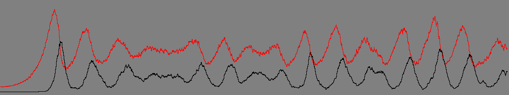
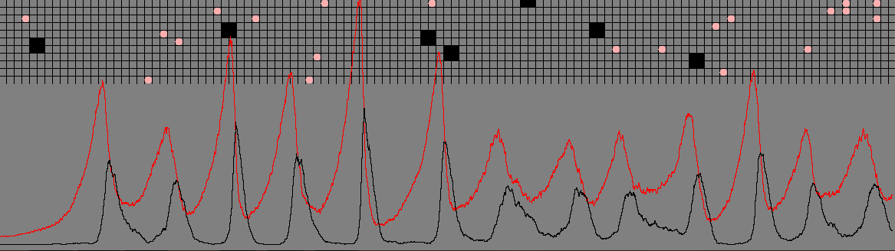
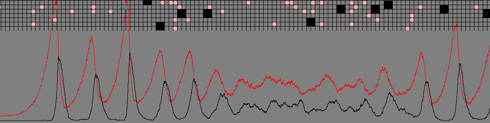
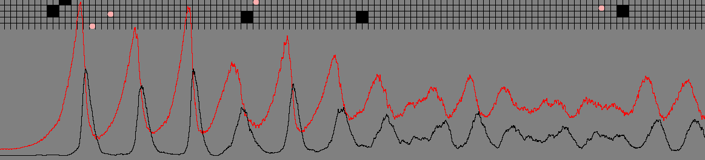
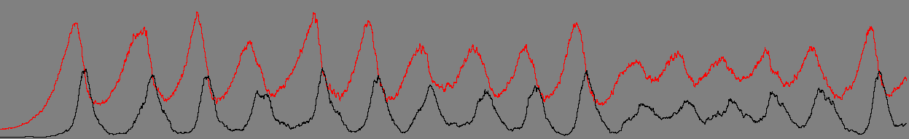

# Sheep_Wolf

半年前把这个小模型做出来了，今天有小小的重构了一下，模型蛮有趣的，以后有空再加入别的控制条件:

-----------------
>以下是代码的具体实现，一共有三个类


#### Forest.java

``` java
package wolf_sheep;

import java.awt.Color;
import java.awt.Frame;
import java.awt.Graphics;
import java.awt.Image;
import java.awt.event.WindowAdapter;
import java.awt.event.WindowEvent;
import java.util.ArrayList;
import java.util.List;

public class Forset extends Frame{
	public static final int ROWS=105;
	public static final int COLS=270;
	public static final int BLOCK_SIZE=5;
	private Image offScreenImage;
 	public static List<Integer> sheepcount = null;
	public static List<Integer> wolfcount = null;
	
	public static void main(String[] args) {
		new Forset().launch();
	}
	
	public void launch(){
		setBounds(10, 10, BLOCK_SIZE*COLS, BLOCK_SIZE*(ROWS+40));
		addWindowListener(new WindowAdapter(){
			public void windowClosing(WindowEvent e){
				System.exit(0);
			}
		});
		sheepcount = new ArrayList<>() ;
		wolfcount = new ArrayList<>();
		Sheep.sheeps.add(new Sheep());
		Wolf.wolfs.add(new Wolf());
		setVisible(true);
		run();
	}

	private void run() {
		while(true){
			repaint();			
			try {
				/**
				 * 设置狼与羊的移动频率 ；
				 */
				Thread.sleep(10);
			} catch (InterruptedException e) {
				e.printStackTrace();
			}
		}
	}

	@Override
	public void paint(Graphics g) {
		g.setColor(Color.GRAY);
		g.fillRect(0, 0, BLOCK_SIZE*COLS, BLOCK_SIZE*(ROWS+40));
		g.setColor(Color.BLACK);
		for (int x=1;x<COLS;x++){
			g.drawLine(BLOCK_SIZE*x, 0, BLOCK_SIZE*x, BLOCK_SIZE*ROWS);
		}
		for (int x=1;x<ROWS;x++){
			g.drawLine(0, BLOCK_SIZE*x, BLOCK_SIZE*COLS, BLOCK_SIZE*x);
		}
		for(int x=0;x<Sheep.sheeps.size();x++){
			/**
			 * 画出羊群的移动路径；
			 */
			Sheep.sheeps.get(x).draw(g);
			Sheep.sheeps.get(x).run();
			Sheep.sheeps.get(x).addNewSheep();
			Sheep.sheeps.get(x).checkDeach();
			/**
			 * 下面的for循环表示两羊相遇死一个；
			 */
			/*
			for(int y=x+1;y<Sheep.sheeps.size();y++){
				if(Sheep.sheeps.get(x).getRect().intersects(Sheep.sheeps.get(y).getRect())){
					Sheep.sheeps.remove(Sheep.sheeps.get(x));
				}
			}
			*/
		}
		for(int x=0;x<Wolf.wolfs.size();x++){
			/**
			 * 画出狼群的移动路径；
			 */
			Wolf.wolfs.get(x).draw(g);
			Wolf.wolfs.get(x).run();
			/**
			 * 狼碰到羊后，狼会把羊吃掉，并生一只小狼；
			 */
			for(int y=0;y<Sheep.sheeps.size();y++){
				if(Sheep.sheeps.get(y).getRect().intersects(Wolf.wolfs.get(x).getRect())){
					Wolf.wolfs.add(new Wolf());
					Sheep.sheeps.remove(Sheep.sheeps.get(y));
				}
			}
			/**
			 * 下面的for循环表示两狼相遇死一个；
			 * 把它注释掉后生态系统会趋向于奔溃，有兴趣可以试一试；
			 */
			for(int y=x+1;y<Wolf.wolfs.size();y++){
				if(Wolf.wolfs.get(x).getRect().intersects(Wolf.wolfs.get(y).getRect())){
					Wolf.wolfs.remove(Wolf.wolfs.remove(x));
				}
			}
			if(x>0){
				Wolf.wolfs.get(x).checkDeach();
			}
		}
		sheepcount.add(Sheep.sheeps.size());
		wolfcount.add(Wolf.wolfs.size());
		int b = 20;
		for(int x=1;x<sheepcount.size();x++){
			g.setColor(Color.RED);
			g.drawLine(b/3,700-sheepcount.get(x-1)/5, b++/3, 700-sheepcount.get(x)/5);
		}
		b = 20;
		for(int x=1;x<wolfcount.size();x++){
			g.setColor(Color.BLACK);
			g.drawLine(b/3,700-wolfcount.get(x-1)/5, b++/3, 700-wolfcount.get(x)/5);
		}
	}
	
	@Override
	public void update(Graphics g) {
		offScreenImage = this.createImage(COLS * BLOCK_SIZE, (ROWS+40) * BLOCK_SIZE);
		Graphics gOff = offScreenImage.getGraphics();
		paint(gOff);
		g.drawImage(offScreenImage, 0, 0, null);
	}
}
```
#### Sheep.java
``` java
package wolf_sheep;

import java.awt.Color;
import java.awt.Graphics;
import java.awt.Rectangle;
import java.util.ArrayList;
import java.util.List;
import java.util.Random;

public class Sheep{
	private int row;
	private int col;
	private int foot;
	private int old ;
	public static List<Sheep> sheeps = new ArrayList<>();
	private  static Random rd = new Random();
	
	public Sheep(){
		row = rd.nextInt(Forset.ROWS-2)+2;
		col = rd.nextInt(Forset.COLS);
	}
	
	public void draw (Graphics g){
		g.setColor(Color.PINK);
		g.fillOval(Forset.BLOCK_SIZE * col, Forset.BLOCK_SIZE * row, Forset.BLOCK_SIZE, Forset.BLOCK_SIZE);
	}
	
	public Rectangle getRect(){
		return new Rectangle(Forset.BLOCK_SIZE * col, Forset.BLOCK_SIZE * row, Forset.BLOCK_SIZE, Forset.BLOCK_SIZE);
	}
	
	public static int giveBirth(){
		int day =rd.nextInt(15)-5;
		if(day>5){
			return day;
		}else{
			return 10;
		}
	}
	
	public void addNewSheep(){	
		if(foot>=Sheep.giveBirth()){
			foot=0;
			sheeps.add(new Sheep());
		}
	}
	
	public void checkDeach(){
		if(this.old>15){
			sheeps.remove(this);
		}
		
	}
	
	public void run() {
		switch (rd.nextInt(4)){
		case 1:
			if(row>5){
				row = row-1;
			}
			break;
		case 2:
			if(col<Forset.COLS-5){
				col = col+1;
			}
			break;
		case 3:
			if(row<Forset.ROWS-5){
				row = row+1;
			}
			break;
		case 0:
			if(col>5){
				col = col-1;
			}
			break;
		}
		foot ++;
		old ++;
	}
}
```
#### Wolf.java
``` java
package wolf_sheep;

import java.awt.Color;
import java.awt.Graphics;
import java.awt.Rectangle;
import java.util.ArrayList;
import java.util.List;
import java.util.Random;

public class Wolf {
	int row;
	int col;
	int old ;
	public static List<Wolf> wolfs = new ArrayList<>();
	private  static Random rd = new Random();
	
	public Wolf(){
		row = rd.nextInt(Forset.ROWS-2)+2;
		col = rd.nextInt(Forset.COLS);
	}
	
	public void draw (Graphics g){
		g.setColor(Color.BLACK);
		g.fillRect(Forset.BLOCK_SIZE * col, Forset.BLOCK_SIZE * row, Forset.BLOCK_SIZE*2, Forset.BLOCK_SIZE*2);
	}
	
	public Rectangle getRect(){
		return new Rectangle(Forset.BLOCK_SIZE * col, Forset.BLOCK_SIZE * row, Forset.BLOCK_SIZE*2, Forset.BLOCK_SIZE*2);
	}
	
	public void checkDeach(){
		if(this.old>50){
			wolfs.remove(this);
		}
	}
	
	public void run() {
		switch (rd.nextInt(4)){
		case 1:
			if(row>5){
				row = row-1;
			}
			break;
		case 2:
			if(col<Forset.COLS-5){
				col = col+1;
			}
			break;
		case 3:
			if(row<Forset.ROWS-5){
				row = row+1;
			}
			break;
		case 0:
			if(col>5){
				col = col-1;
			}
			break;
		}
		old ++;
	}
}
```
- **下面是狼与羊的数量变化曲线图**





